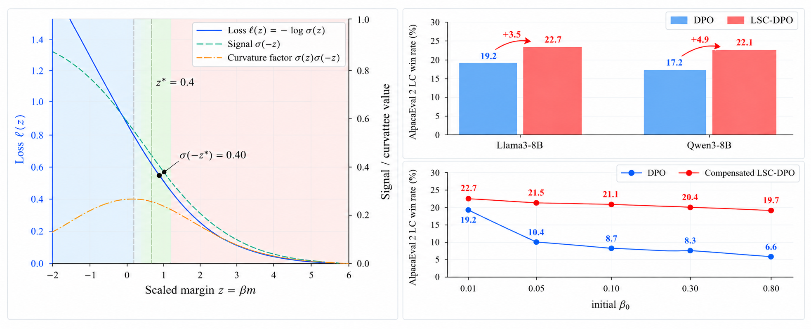

# LSC-DPO: Learning-Signal-Controlled Direct Preference Optimization

This repository contains the code and experimental configurations for our paper **LSC-DPO: Learning-Signal-Controlled Direct Preference Optimization**.

We study Direct Preference Optimization (DPO) from a loss-level geometric perspective and identify the sigmoid factor $\sigma(-z)$ as a learning signal that characterizes the local sensitivity of the DPO objective. Based on this view, we propose **LSC-DPO**, a feedback-control approach that dynamically maintain the learning signal near a target regime. LSC-DPO consistently improves over DPO and strong preference-optimization baselines on AlpacaEval 2, MT-Bench, and Anthropic-HH. We further analyze sensitivity to the initial coefficient and introduce a signal-budget compensation rule that substantially reduces the resulting performance variation.

<p align="center">
  
</p>

📄 **Paper:** [arXiv](TODO)

## Installation

The implementation uses data and training utilities adapted from the [Alignment Handbook](https://github.com/huggingface/alignment-handbook).

Clone the repository and install the dependencies using [`uv`](https://docs.astral.sh/uv/):

```sh
git clone https://github.com/SeanYHan888/lsc-dpo.git
cd lsc-dpo
uv sync --frozen
```

## Training
The core LSC-DPO implementation is in `lsc_dpo/lsc_dpo_trainer.py`, with training arguments defined in `lsc_dpo/lsc_dpo_config.py`. We provide six LSC-DPO configurations for Llama3-8B and Qwen3-8B on UltraFeedback and the Anthropic-HH helpful-base and harmless-base subsets. The launch commands below use four GPUs.

Before training, replace `put in your sft path name` in the corresponding YAML file under `training_configs/` with your SFT checkpoint path or Hugging Face model ID.

**Llama3-8B, UltraFeedback**

```sh
uv run --frozen accelerate launch --config_file fsdp/llama3-fsdp.yaml \
  lsc_dpo/run_lsc_dpo.py training_configs/llama3-ultrafeedback-lsc.yaml
```

**Qwen3-8B, UltraFeedback**

```sh
uv run --frozen accelerate launch --config_file fsdp/qwen3-fsdp.yaml \
  lsc_dpo/run_lsc_dpo.py training_configs/qwen3-ultrafeedback-lsc.yaml
```

**Llama3-8B, Anthropic-HH**

```sh
uv run --frozen accelerate launch --config_file fsdp/llama3-fsdp.yaml \
  lsc_dpo/run_lsc_dpo.py training_configs/llama3-hh-helpful-lsc.yaml
```

```sh
uv run --frozen accelerate launch --config_file fsdp/llama3-fsdp.yaml \
  lsc_dpo/run_lsc_dpo.py training_configs/llama3-hh-harmless-lsc.yaml
```

**Qwen3-8B, Anthropic-HH**

```sh
uv run --frozen accelerate launch --config_file fsdp/qwen3-fsdp.yaml \
  lsc_dpo/run_lsc_dpo.py training_configs/qwen3-hh-helpful-lsc.yaml
```

```sh
uv run --frozen accelerate launch --config_file fsdp/qwen3-fsdp.yaml \
  lsc_dpo/run_lsc_dpo.py training_configs/qwen3-hh-harmless-lsc.yaml
```

## Evaluation
We evaluate LSC-DPO on **AlpacaEval 2**, **MT-Bench**, and **Anthropic-HH**, following the evaluation protocols described in the paper.

For AlpacaEval 2 and MT-Bench, we follow the official evaluation implementations:

The YAML files below record settings for our historical evaluation harness. They are not direct command-line inputs to AlpacaEval or FastChat; use their settings when configuring those tools.

- **AlpacaEval 2:** Please refer to the official [AlpacaEval repository](https://github.com/tatsu-lab/alpaca_eval) for evaluation. Model-specific evaluation configurations are provided in [`eval/alpacaeval2/`](eval/alpacaeval2/).

- **MT-Bench:** Please refer to the official [FastChat repository](https://github.com/lm-sys/FastChat) for evaluation. Model-specific evaluation configurations are provided in [`eval/mtbench/`](eval/mtbench/).

For **Anthropic-HH**, we follow the pairwise evaluation protocol described in the paper.

Model-specific evaluation configurations are provided in [`eval/hh/`](eval/hh/).

## Citation

```bibtex
@misc{qu2026lscdpo,
  title={LSC-DPO: Learning-Signal-Controlled Direct Preference Optimization},
  author={Yang Qu and Yusheng Han and Chengjia Feng and Handan Liu},
  year={2026},
  eprint={2610.07592},
  archivePrefix={arXiv},
  primaryClass={cs.AI},
  url={https://arxiv.org/abs/2610.07592}
}
```